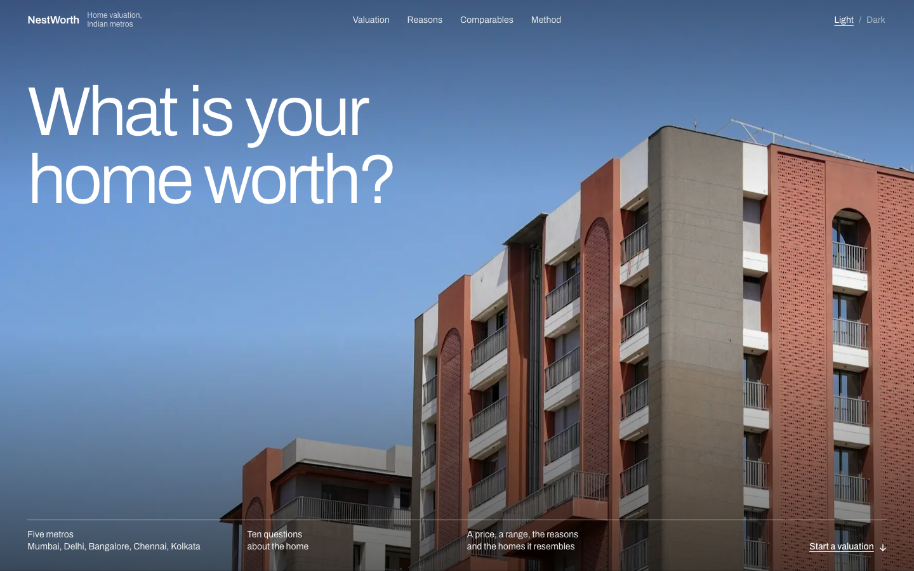
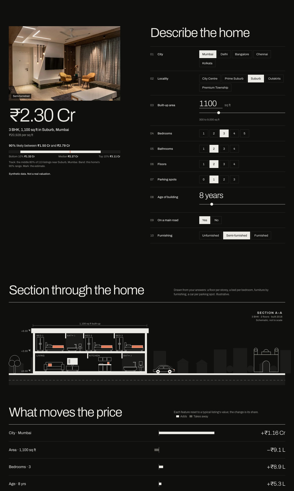

# NestWorth

Home valuations for five Indian metros: Mumbai, Delhi, Bangalore, Chennai and Kolkata.
Describe a home and NestWorth returns a price in lakh or crore, a **calibrated 90% range**,
the features pushing the price up or down, and the five most similar listings. Every
control updates the valuation live, swaps the room photograph to match the furnishing, and
redraws a section through the home: a floor per storey, a bed per bedroom, furniture by
furnishing, a car per parking spot, and the city's landmark on the skyline.

**Live:** https://samgabrielofficially-nestworth.hf.space





A scikit-learn pipeline with XGBoost, served by FastAPI with a hand-built HTML/CSS/JS
frontend, running in Docker on Hugging Face Spaces.

## Results

Three models compared on the same 80/20 split (`artifacts/metrics.csv`):

| Model | MAE (₹) | RMSE (₹) | R² |
|---|---:|---:|---:|
| **XGBoost** | 14.2 L | 27.9 L | **0.907** |
| Random Forest | 16.2 L | 29.6 L | 0.896 |
| Linear Regression | 24.1 L | 36.7 L | 0.840 |

The tree models win because city and locality change the price *per square foot*, an
interaction a linear model can't capture. The 90% interval covers **90.0%** of held-out
prices.

## Project layout

```
main.py                  entry point: serves the app on :7860
pyproject.toml           dependencies (runtime, [train], [dev])
Dockerfile               the image Hugging Face Spaces runs
src/
  pipeline/
    generate.py          synthetic dataset -> data/housing_data.csv
    prepare.py           cleaning + the model Pipeline (features, encoding, scaling)
    eda.py               six charts -> reports/figures/
    train.py             compare models, fit the interval -> artifacts/
  predictor.py           loads artifacts once; one home -> full valuation
  api/
    app.py               FastAPI: POST /api/predict + the static frontend
    static/              index.html, style.css, app.js, scene.js (the section drawing), img/, fonts/
artifacts/               model.pkl, interval.pkl, metrics.csv
data/                    housing_data.csv (raw), housing_clean.csv
tests/                   test_pipeline.py, test_api.py
```

## Run it

```bash
git clone https://github.com/SamGabriel-Here/nestworth.git
cd nestworth
python -m venv .venv && source .venv/bin/activate
pip install -e ".[train,dev]"

python main.py                      # http://localhost:7860
```

Rebuild everything from scratch:

```bash
python -m src.pipeline.generate     # data/housing_data.csv
python -m src.pipeline.eda          # reports/figures/*.png
python -m src.pipeline.prepare      # data/housing_clean.csv
python -m src.pipeline.train        # artifacts/ + model_comparison.png
pytest
```

Or run the container: `docker build -t nestworth . && docker run -p 7860:7860 nestworth`.

## How it works

**Data.** `generate.py` creates about 1,500 listings priced at each city's rate per square
foot (from about ₹5,500 in Kolkata to about ₹18,000 in Mumbai), adjusted by locality, rooms,
age, parking, road access and furnishing. It deliberately adds missing values, duplicates
and outliers so the cleaning step has real work to do. The data is synthetic; the site
says so on every valuation.

| Column | Description |
|---|---|
| `area` | Built-up area in sq ft |
| `bedrooms`, `bathrooms`, `stories` | Room and floor counts |
| `city` | Mumbai, Delhi, Bangalore, Chennai, Kolkata |
| `location` | City Centre, Prime Suburb, Suburb, Outskirts, Premium Township |
| `house_age` | Age in years |
| `parking` | Parking spots |
| `main_road` | Faces a main road (yes/no) |
| `furnishing_status` | furnished / semi-furnished / unfurnished |
| `price` | Target: sale price in ₹ |

**Cleaning** (`prepare.py`):
- missing values are filled with the median (numeric) or mode (categorical);
- duplicates are dropped;
- `price` and `area` outliers are capped with the IQR rule.

**Model pipeline.** Everything the model needs happens inside one scikit-learn `Pipeline`,
so the saved model handles raw input exactly as it did in training:
- feature engineering (`total_rooms`, `is_new`);
- one-hot encoding and scaling;
- the regressor.

**90% range.** The range comes from conformalized quantile regression:
- two XGBoost quantile models (5th and 95th percentile) are fit on part of the training set;
- they're widened on a held-out calibration split until 90% of unseen prices fall inside.

The range adapts to the home: a few lakh wide for a budget flat, over a crore for a premium one.

**Reasons.** Each feature is reset in turn to a typical listing's value (median or mode) and
the home is re-priced. The change is that feature's contribution. The top five by size are shown.

**Comparables.** The five listings closest in area within the same city and locality
(falling back to the whole city when the locality has fewer than 8).

**API.** `POST /api/predict` validates input with Pydantic and returns:
- `estimate` and `price_per_sqft`;
- `interval` (`lo`, `hi`, `coverage`);
- the locality's price spread, `segment` (10th, 50th and 90th percentile);
- `factors` and `comparables`.

Out-of-range input returns 422.

## Design

A formal, editorial layout on a 12-column grid: a full-bleed photograph, a numbered
specification form beside a sticky estimate, and a live section drawing of the home in
architectural line style. Light and Dark themes swap the photographs (day and night).
Archivo is self-hosted (SIL Open Font License, `src/api/static/fonts/OFL.txt`).

Photography, all free under the [Unsplash License](https://unsplash.com/license):

| File | Photo | Photographer |
|---|---|---|
| `img/hero-day.webp` | [Residential towers](https://unsplash.com/photos/04FfOI_aYy4) | Vaibhav Surana |
| `img/hero-night.webp` | [House at dusk](https://unsplash.com/photos/hmlP-v0vJ5o) | Elite prop |
| `img/room-unfurnished.webp` | [Empty room](https://unsplash.com/photos/4YhNRgL59Fc) | Christian Lue |
| `img/room-semi.webp` | [Living room](https://unsplash.com/photos/CfBDgt5BafU) | Dinesh Lunked |
| `img/room-furnished.webp` | [Furnished living room](https://unsplash.com/photos/CgA03H9jCKw) | Pyx Photography |

## Possible improvements

- Hyperparameter search and k-fold cross-validation
- A real dataset with richer features
- SHAP attributions in place of single-feature ablation

## Stack

Python, pandas, NumPy, scikit-learn, XGBoost, FastAPI, Pydantic, Matplotlib, Seaborn,
pytest, Docker. Deployed on Hugging Face Spaces.

## License

MIT, see [LICENSE](LICENSE).
